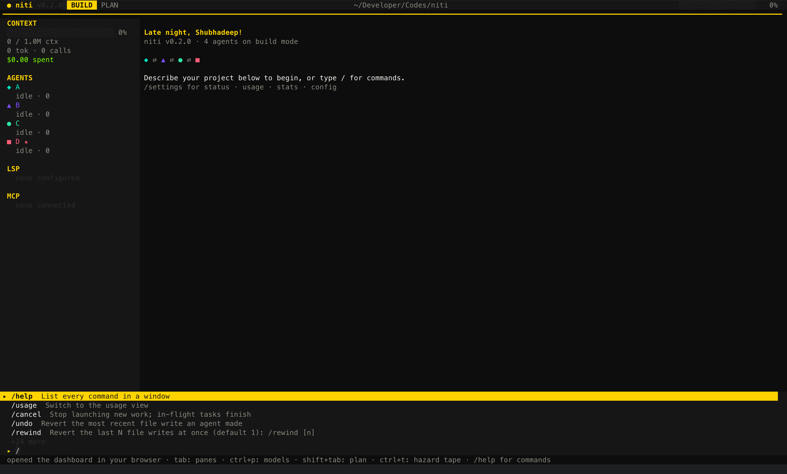
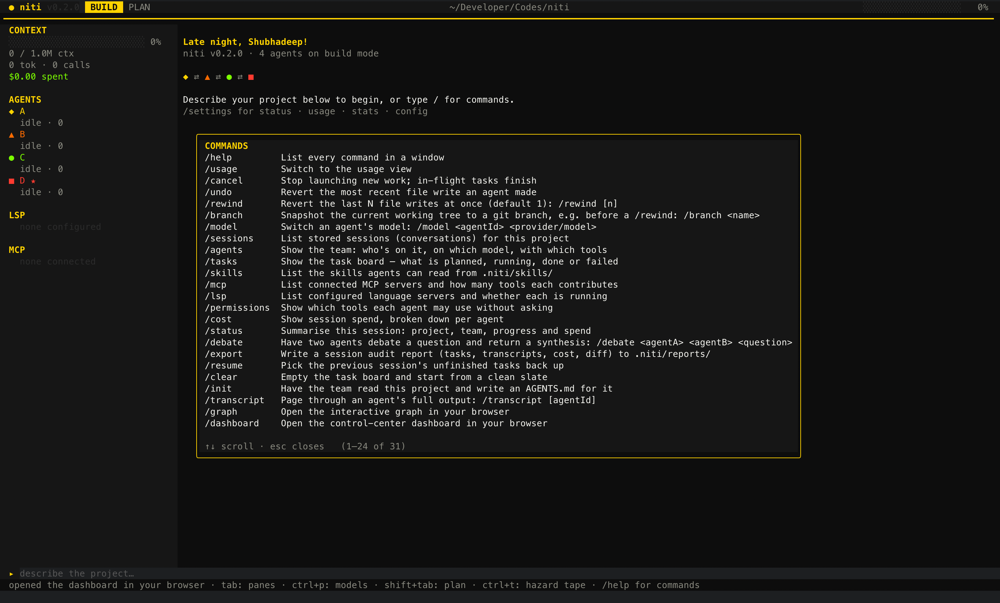
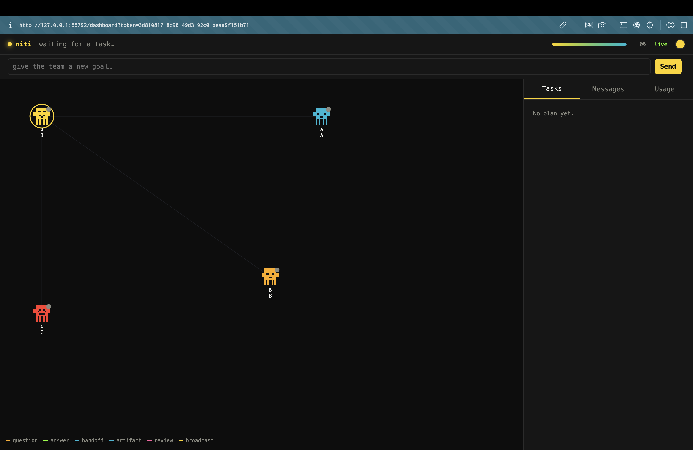
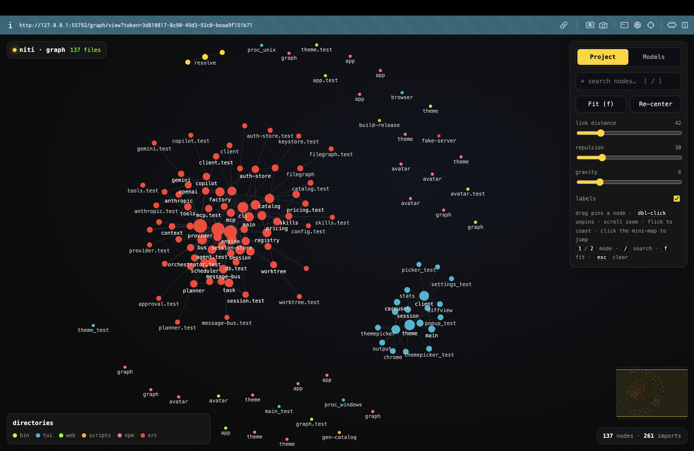
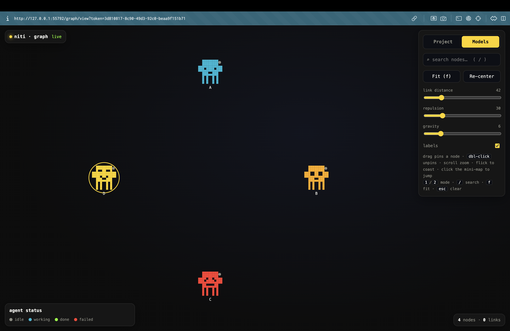
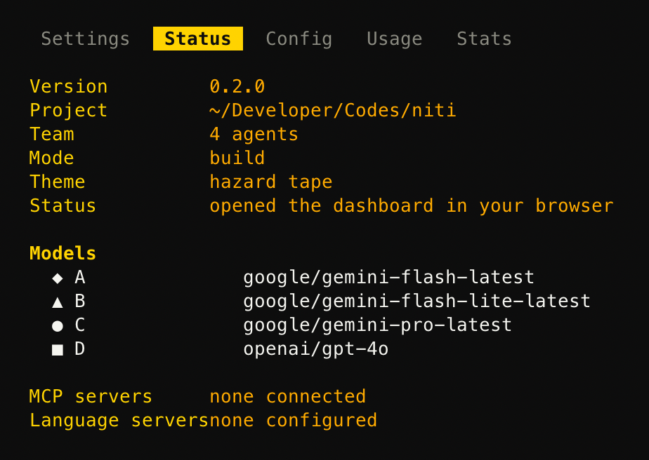
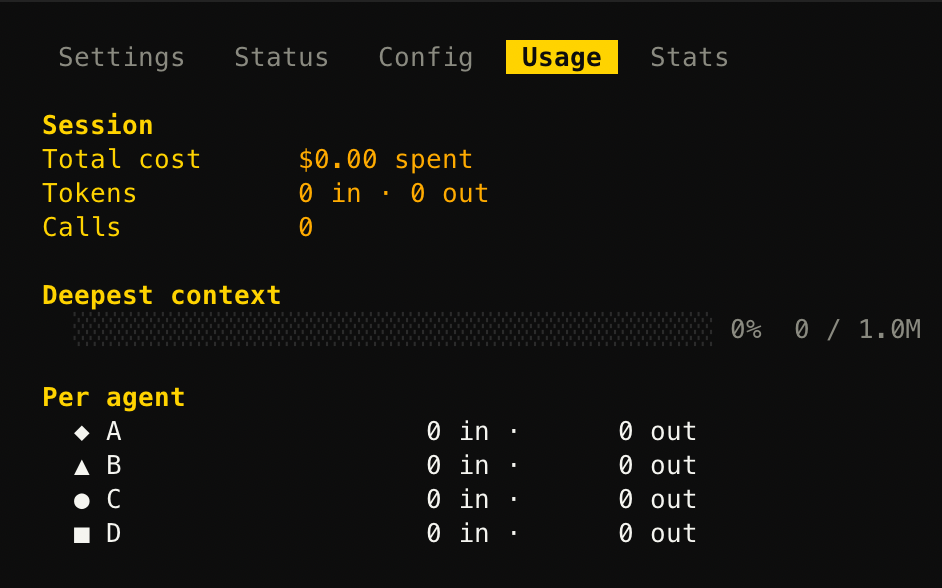
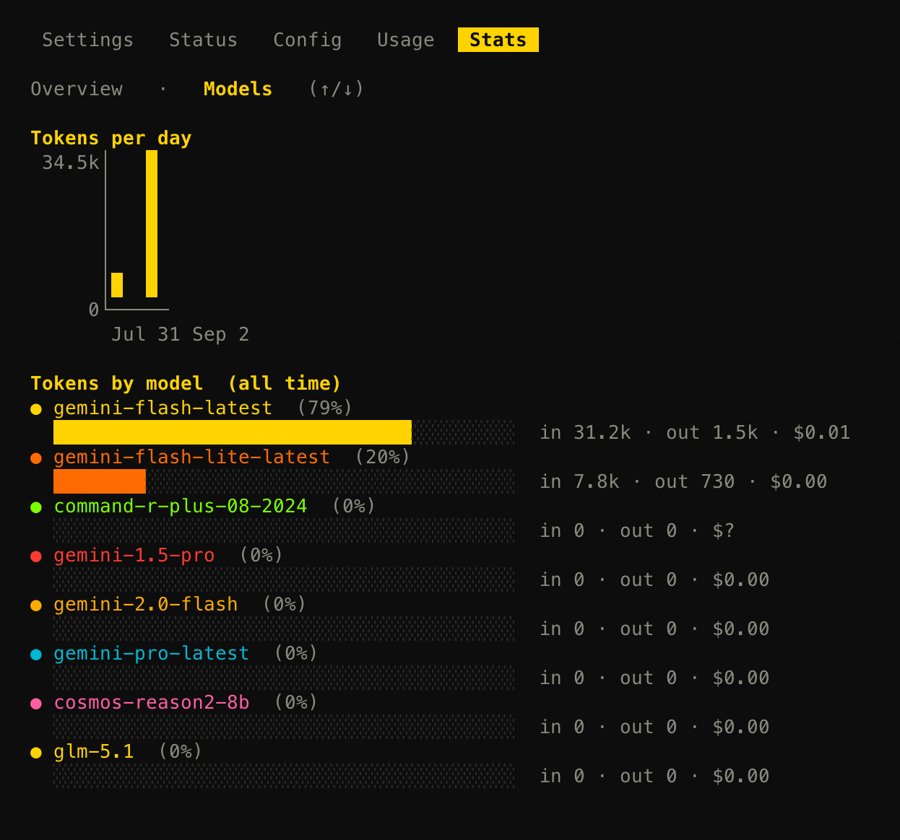

# niti

**A terminal CLI that runs multiple AI coding agents — from different LLM providers — concurrently on one project.**

Assign models to custom roles (Gemini = Frontend, Claude = Backend, GPT = Reviewer...), pick one as the **orchestrator** to plan the work into a task DAG, and watch the team build together, **talking to each other directly** to stay aligned — live in your terminal, or in an optional web dashboard.

[](#license)
[](#two-front-ends-one-core)
[](#two-front-ends-one-core)



## Quickstart

```sh
npm install -g @slenderbuilds/niti   # prebuilt binaries — no Bun, no Go, no build step
niti                                 # pick your team, then start building
```

> Published as **`@slenderbuilds/niti`** — the unscoped `niti` was rejected by npm's own
> anti-squatting check (too similar to `jiti`/`vite`/others), and it suggested this scope. The
> commands are still `niti` (TUI) and `niti-core` (headless engine); project state still lives
> in `.niti/` — only the install name changed.

On first launch, `niti` opens a picker: how many teammates (1–6), then per teammate — provider,
model, name, and a one-line job description. **29 providers / 152 models** from the
[Models.dev](https://models.dev) catalog, plus local (Ollama/LM Studio) and **Custom** for any
OpenAI-compatible endpoint. Keys live in `~/.config/niti/auth.json` (0600) and your OS keychain —
never a server.

Type `/` for the full command list:



## Watch it from the browser too

`/dashboard` opens a live control center — agent avatars, message graph, task board, and per-agent
usage, all pushed over SSE as the team works:



`/graph` opens an interactive force-graph — your project's file/import structure, or (toggle to
**Models**) the live agent-to-agent conversation as it happens:

<table>
<tr>
<td width="50%"></td>
<td width="50%"></td>
</tr>
<tr>
<td>Project mode — every file, colored by directory</td>
<td>Models mode — your team, colored by status, talking in real time</td>
</tr>
</table>

Both pages retheme live with whatever theme (`ctrl+t` / `/theme`) the TUI has active.

## Everything, at a glance

`/settings` (or `tab`) opens Status, Config, Usage, and Stats panes without leaving the session:

<table>
<tr>
<td width="33%"></td>
<td width="33%"></td>
<td width="34%"></td>
</tr>
</table>

## What's actually happening under the hood

- **Orchestrator DAG** — the lead agent turns your goal into a validated task graph (dependencies +
  hand-offs), not a flat queue; independent tasks run concurrently and the lead reviews at the end.
- **Agent-to-agent messaging** — any teammate can `ask_agent`/`send_message` another mid-task (e.g.
  frontend asking backend about an API shape), rate-capped per pair as the loop guard.
- **Sandboxed tools** — `read_file` / `write_file` / `edit` / `shell`, gated per-agent by
  `allowedTools` and a wildcard permission policy; every path is jailed to the project root.
- **Approval gates** — agents pause for `[y] approve · [n] deny · [a] always` before risky actions,
  answered from the TUI or the web dashboard; dangerous shell patterns always prompt.
- **Persistence** — every turn checkpoints to SQLite (`.niti/niti.db`); `niti-core resume` picks up
  unfinished tasks with history intact. `/undo` and `/rewind` revert file writes.
- **MCP + LSP** — declare `mcpServers`/`lsp` in `agents.yaml`; both merge into the same tool loop,
  gated the same way as everything else.
- **Failover** — a 429/overload/context-limit requeues the task instead of failing it; another agent
  picks it up.

See [`project_context.md`](./project_context.md) for the full architecture record, the verification
history, and the deliberate ceilings (what's intentionally out of scope, and why).

## Configuring agents

`niti` rewrites only the `agents:` block on each team pick — everything else survives a relaunch.
Edit `.niti/agents.yaml` directly for anything the picker doesn't cover:

```yaml
agents:
  - id: architect
    provider: anthropic
    model: claude-opus-4-8
    role: Architect
    lead: true
    systemPrompt: You are a software architect. Decompose work into independent subtasks.
  - id: engineer
    provider: openai
    model: gpt-4o
    role: Backend Engineer
    systemPrompt: You are a backend engineer. Implement the assigned task.
    allowedTools: [read_file, write_file, edit, shell, mcp]

permissions:
  shell: { "git *": allow, "git commit *": ask, "rm -rf*": deny }
  write_file: { "src/**": allow, "*": ask }

mcpServers:
  - name: code-review
    command: code-review-graph
    args: [--stdio]

theme: niti          # ctrl+t / /theme opens a live carousel, synced to any open dashboard/graph tab
auto: false          # approve anything not explicitly denied
maxAgents: 6
```

Full config reference — permissions resolution order, environment variables, LSP setup — lives in
[`project_context.md`](./project_context.md).

## From source

Requires [Bun](https://bun.sh) ≥ 1.3 and [Go](https://go.dev) ≥ 1.22.

```sh
bun install
bun run build:tui                 # builds ./niti (the Go TUI)
./niti
```

Headless / scripting, no interactive terminal needed:

```sh
bun run src/cli.ts "Build a clothing website for gen-z."   # one-shot
bun run src/cli.ts --web "..."                              # + live web dashboard
bun run src/server/main.ts                                  # headless server, prints its own handshake URL
```

## Development

```sh
bun test                                                     # TypeScript unit + integration tests
bunx tsc --noEmit                                             # typecheck
cd tui && go build ./... && go vet ./... && go test ./...    # Go TUI: build, vet, unit tests
```

## License

MIT.
