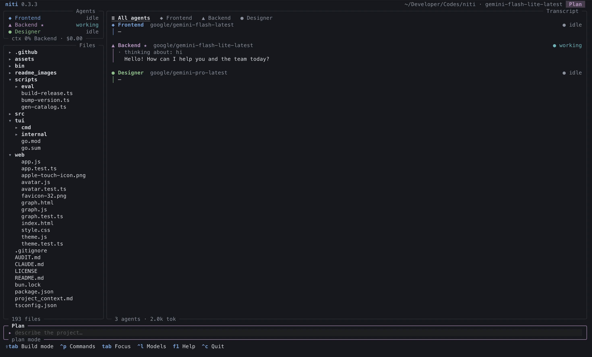
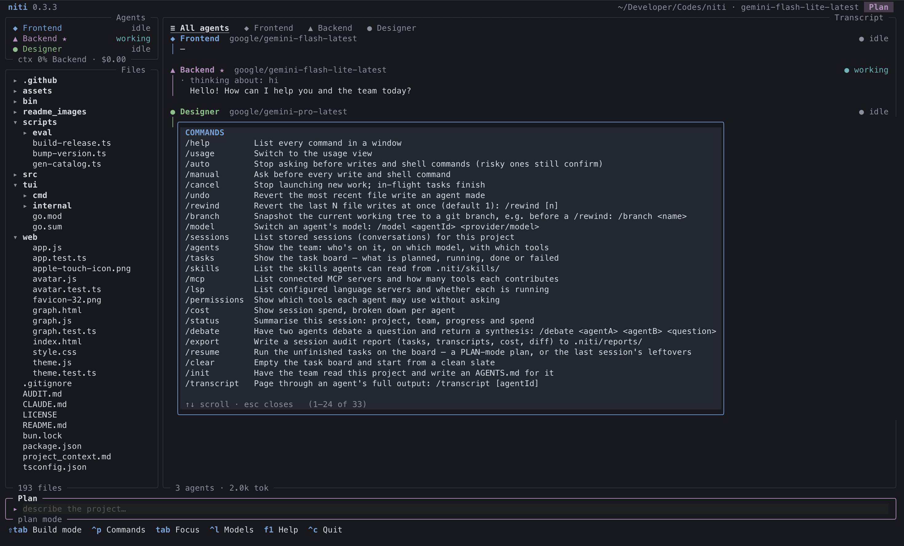
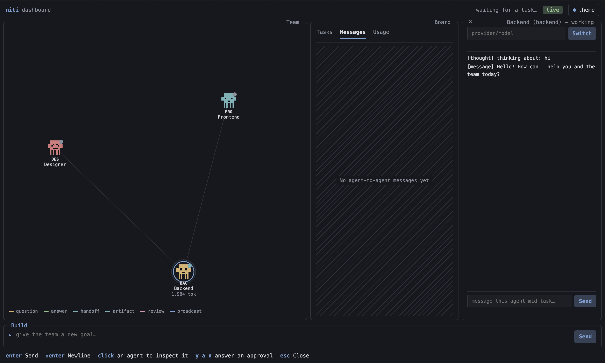
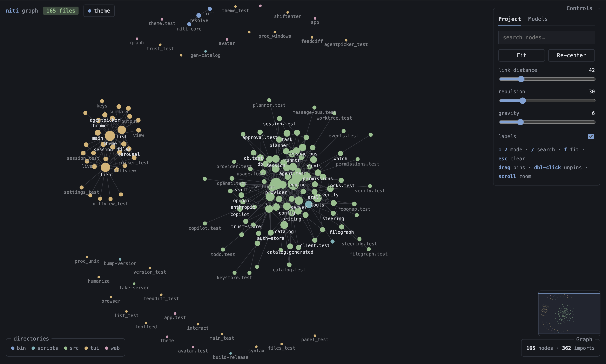
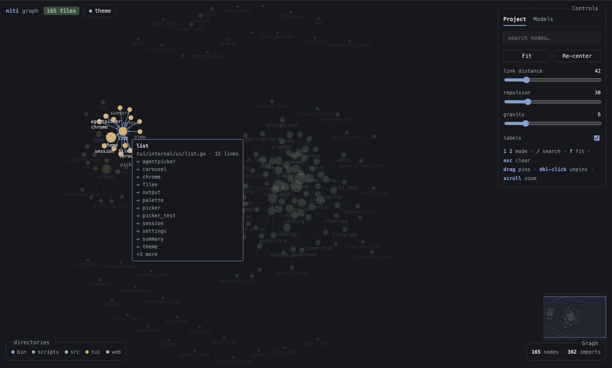
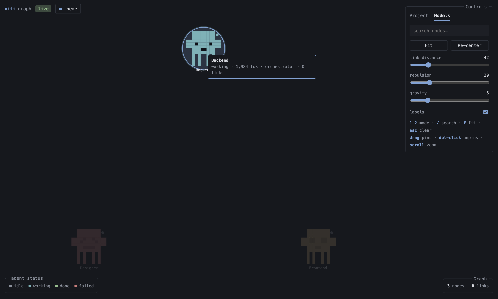
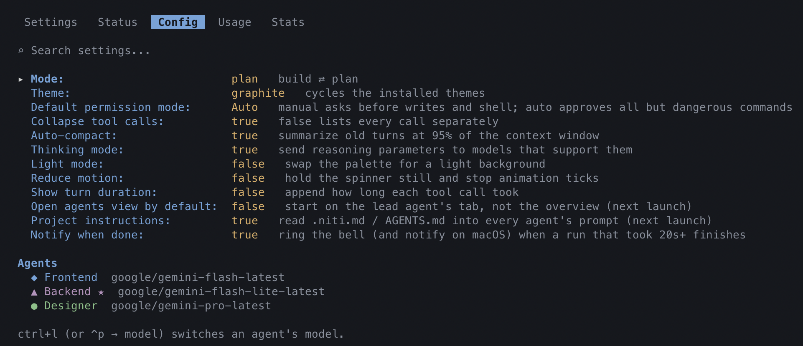
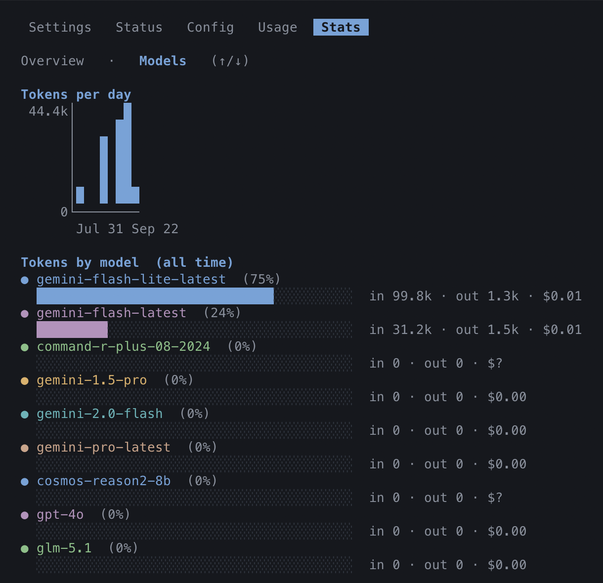

<div align="center">

<br>


<picture>
  <source media="(prefers-color-scheme: dark)" srcset="assets/wordmark-dark.svg">
  <source media="(prefers-color-scheme: light)" srcset="assets/wordmark-light.svg">
  
</picture>

### A team of AI coding agents, on any mix of models, working on one project — live in your terminal.

<br>

[](https://www.npmjs.com/package/@slenderbuilds/niti)
[](https://github.com/slenderongithub/niti/actions/workflows/ci.yml)
[](#install)
[](#license)

**[Install](#install)** &nbsp;·&nbsp; **[The terminal](#the-terminal)** &nbsp;·&nbsp; **[In the browser](#in-the-browser)** &nbsp;·&nbsp; **[Under the hood](#under-the-hood)** &nbsp;·&nbsp; **[Configure](#configure)**

<br>



</div>

<br>

## Install

```sh
npm install -g @slenderbuilds/niti
niti
```

Prebuilt for macOS, Linux and Windows — no Bun, no Go, no build step. On first launch niti asks
how many teammates you want (1–6) and, for each, a **provider**, a **model**, a **name** and a
one-line **job**. One of them leads: it turns your request into a plan, the others build it, and
they talk to each other as they go.

Anthropic, OpenAI, Gemini, OpenRouter, DeepSeek, Groq, xAI, Mistral and many more come from the
[Models.dev](https://models.dev) catalog, alongside local models (Ollama, LM Studio) and any
OpenAI-compatible endpoint. Keys stay on your machine — `~/.config/niti/auth.json` (mode 0600) and
your OS keychain.

<br>

## What you get

<table>
<tr>
<td width="50%" valign="top">

**A team, not a chatbot**<br>
Mix models by strength — a careful model to plan, a fast one to build, a cheap one to review. The
lead plans the work as a dependency graph; independent tasks run at the same time; teammates ask
each other questions directly.

</td>
<td width="50%" valign="top">

**Watch it work**<br>
Every edit appears as a numbered, syntax-colored diff. Commands stream their output, then fold to a
one-line result. Each agent's checklist stays pinned. Every run ends with a summary card and a
suggested next step.

</td>
</tr>
<tr>
<td width="50%" valign="top">

**Talk to it mid-run**<br>
Say hello and it says hello — no invented work. Ask a question and it reads the code to answer.
Anything you type while agents work steers them; <kbd>esc</kbd> stops them at once.

</td>
<td width="50%" valign="top">

**Guardrails on by default**<br>
Approvals before risky actions, a project-scoped sandbox, verification against your own build
before a task counts as done, undo and rewind for every write, and a check that refuses "fixes"
that only edited the tests.

</td>
</tr>
</table>

<br>

## The terminal

The footer always lists the keys that work where you are, and <kbd>f1</kbd> explains them — along
with every glyph in the transcript. The ones worth knowing on day one:

| Key | |
|---|---|
| <kbd>^p</kbd> | Command palette — every command, view, agent and theme, fuzzy-searchable |
| <kbd>tab</kbd> | Move focus: prompt → transcript → agents → files |
| <kbd>⇧tab</kbd> | Switch **Build** ↔ **Plan** (plan first, run when you like it) |
| <kbd>esc</kbd> | While agents work: interrupt them. Anything you type mid-run steers the working agent |
| <kbd>^o</kbd> | Unfold full command output and whole diffs |
| <kbd>^l</kbd> | Switch an agent's model |
| <kbd>^t</kbd> | Theme picker with live preview |
| <kbd>↑</kbd> · <kbd>^r</kbd> | Recall or search earlier prompts |
| `@path` · `!cmd` | Mention a project file · run a command right here |

The **Files** panel marks what the agents touched this session — **M** edited, **A** created,
**·** read. Open any file read-only with this session's changes marked, or hand it to `$EDITOR`.

Type <kbd>/</kbd> for every command:



**Themes** — six calm palettes (graphite, obsidian, ember, tide, dusk, moss), each with a designed
light version that takes over when you turn on light mode. Or add your own in
`~/.config/niti/themes/*.json`.

<br>

## In the browser

`/dashboard` opens a live control center: the team as a graph, the task board, agent-to-agent
messages and usage, updated as the work happens. Click an agent to read its transcript, switch its
model or message it mid-task. Approvals can be answered here too.



`/graph` maps your project's imports — or, in **Models** mode, the team talking in real time.


<p align="center"><sub><b>Project mode</b> — every file, colored by directory</sub></p>


<p align="center"><sub><b>Hover</b> — trace what a file imports and what imports it</sub></p>


<p align="center"><sub><b>Models mode</b> — the team talking, live</sub></p>

Both pages follow the theme you pick in the terminal.

<br>

## Settings, at a glance

`/settings` opens Status, Config, Usage and Stats without leaving the session.

<table>
<tr>
<td width="50%"></td>
<td width="50%"></td>
</tr>
</table>

<br>

## Under the hood

- **Talks before it plans** — a greeting gets a reply and a question gets an answer (read-only). Only
  a request to change something becomes a plan, and a follow-up adjusts the unfinished plan instead
  of replacing it. The lead remembers the last few exchanges.
- **Plans as a graph** — the lead turns a request into tasks with dependencies and hand-offs;
  independent tasks run concurrently, and the lead reviews the result at the end.
- **Agents talk to each other** — any teammate can ask another mid-task (the frontend asking the
  backend about an API shape), rate-capped per pair.
- **Starts oriented** — a map of the repository (its layout and the files most of it depends on)
  rides in every agent's prompt, so work begins with context instead of guesses.
- **Verified before "done"** — an agent that changed files must pass your project's own checks
  (a `typecheck` or `build` script, `go build`, `cargo check`, or whatever `verify:` names). A task
  that never passes ends `unverified`, and is retried on a different model before any replan.
- **Honest about cost** — prompt caching tuned per provider (Anthropic breakpoints, OpenAI cache
  keys, Gemini implicit caching), reasoning effort per agent, real per-model context windows and
  prices, and thinking tokens counted — see `/cost`.
- **Guarded tools** — `read_file`, `write_file`, `edit`, `shell` and read-only search, gated per
  agent and by a permission policy; paths are jailed to the project; dangerous commands always ask.
- **Picks up where you left off** — every turn checkpoints to SQLite; `niti-core resume` continues
  unfinished work, and `/rewind [n]` reverts the last n file writes.
- **Extensible** — MCP servers and language servers join the same tool loop, under the same gates.

The full architecture record, the verification history and what is deliberately out of scope live
in [`project_context.md`](./project_context.md).

<br>

## Configure

The team picker rewrites only the `agents:` block of `.niti/agents.yaml`; everything else is
yours to edit.

```yaml
agents:
  - id: architect
    provider: anthropic
    model: claude-opus-5
    role: Architect
    lead: true
    reasoning: high
    systemPrompt: You are a software architect. Plan the work into independent tasks.
  - id: engineer
    provider: openai
    model: gpt-5
    role: Backend Engineer
    systemPrompt: You are a backend engineer. Implement the assigned task.
    allowedTools: [read_file, write_file, edit, shell, mcp]

permissions:
  shell: { "git *": allow, "git commit *": ask, "rm -rf*": deny }
  write_file: { "src/**": allow, "*": ask }

mcpServers:
  - name: code-review
    command: code-review-graph
    args: [--stdio]

theme: graphite
auto: false   # true: approve anything not explicitly denied
```

<br>

## Build from source

Requires [Bun](https://bun.sh) ≥ 1.3 and [Go](https://go.dev) ≥ 1.22.

```sh
bun install
bun run build:all          # ./niti (terminal UI) and ./niti-core (engine)
./niti
```

Headless, for scripts and CI:

```sh
bun run src/cli.ts "Build a clothing website for gen-z."   # one-shot
bun run src/cli.ts --web "…"                               # with the live dashboard
```

Tests: `bun test` · `bunx tsc --noEmit` · `cd tui && go test ./...`

<br>

## License

MIT

<br>

<div align="center">

<br>
<sub>Built for people who would rather watch their tools work than wonder what they're doing.</sub>
</div>
